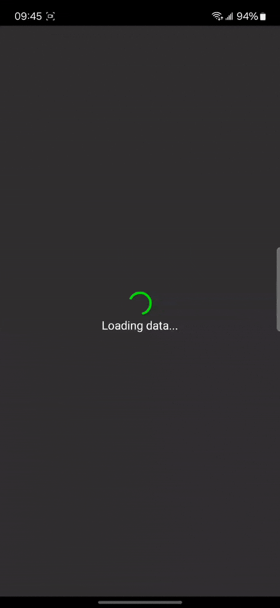
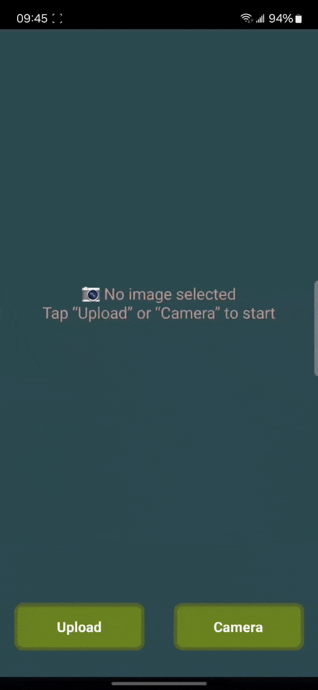
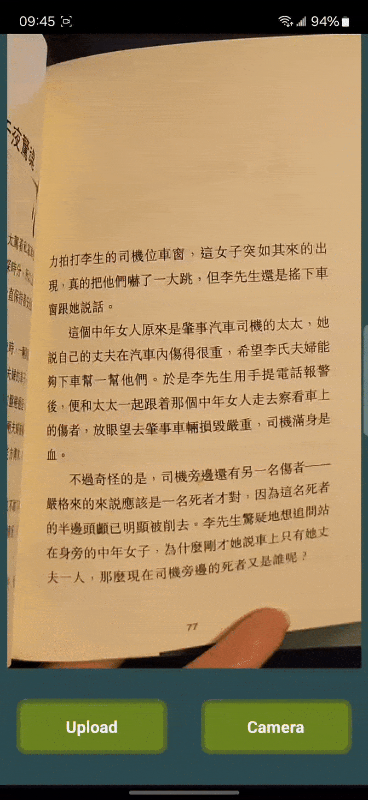
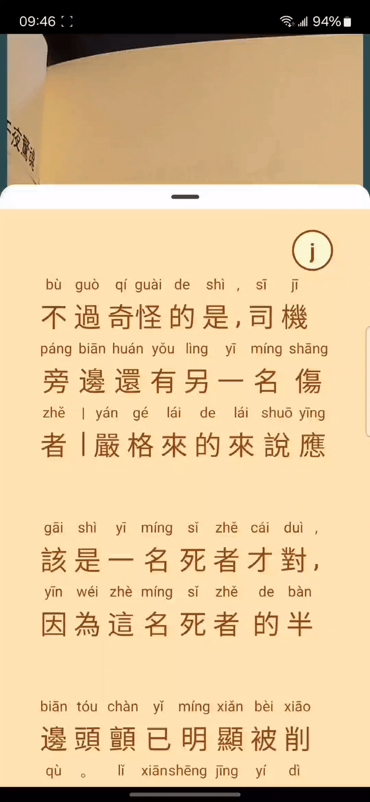

# Chinese Reader

This is a React Native project I built to enhance Chinese language learning through reading.
I wanted to learn React Native and app development while also solving a real-world problem I
experienced in my Chinese language learning journey. This app allows the user to take a photo
of Chinese text and read unknown characters through pinyin and jyutping.

## Features

- Text block and character recognition
- Word segmentation
- Pinyin and jyutping ruby text
- Dictionary lookup

### Text block and character recognition
User can toggle back and forth between blocks to be displayed on the 	BottomSheetScrollView by tapping the empty space on either the right or left halves of the BottomSheetScrollView.

Note: Due to camera or image quality, characters may be misrecognized or unrecognized by the OCR.
### Word segmentation

Since Chinese does not delimit words by spaces like English, a segmentation tool is necessary to differentiate different words for the computer. It also assists learners in being able to recognize words made up of multiple characters.

Note: Some words are not segmented correctly (a two character word may be recognized as two one character words) but it still provides a basic functionality.

### Pinyin and jyutping ruby text
Lookup the pronunciation for Mandarin (pinyin) or Cantonese (jyutping). Stacks the pronunciation on top of the character in a ruby text format.

Note: the tool is not 100% accurate. I have seen at least one character have the incorrect pinyin.

### Dictionary lookup
Lookup the English translation of a Chinese word and display it in a Popover.

Note: Due to differences between the segmentation and dictionary tools, some words may 	not have translations available.

## Demo

1. Open the app. On the first open, it needs to load the dictionary data into memory. This takes a few seconds.  
   

2. Select the photo, either by upload or camera.  
   

3. Tap on a block of text to see the characters and their pinyin/jyutping.  
   

4. Toggle between pinyin and jyutping.  
   

5. Tap on a word to see its English definition.  
   

6. Tap on the right or left side of the BottomSheetScrollView to move up or down blocks.  
   

7. Tap the back button to close the BottomSheetScrollView and select another image to read.  
   

## Tech Stack

This project utilizes the following technologies and libraries. See full dependencies in [package.json](./package.json) 

### Core
- **React Native** - Cross-platform mobile app framework
- **TypeScript** - Type-safe JavaScript variant

### UI Components
- **React Native Gesture Handler** - Native touch and gesture system
- **@gorhom/bottom-sheet** - Bottom sheet component
- **react-native-popover-view** - Popover component for displaying dictionary information

### Image Processing
- **react-native-image-picker** - Image selection from gallery or camera
- **@react-native-ml-kit/text-recognition** - ML-powered text recognition from images

### Chinese Language Processing
- **pinyin-pro** - Chinese pinyin conversion and word segmentation
- **to-jyutping** - Cantonese romanization conversion
- **chinese-lexicon** - Chinese dictionary and glossary tools
- **@pinyin-pro/data/modern** - Modern Chinese dictionary data

### Utilities
- **react-native-reanimated** - Smooth animations and gestures
- **react-native-activity-indicator** - Loading indicators